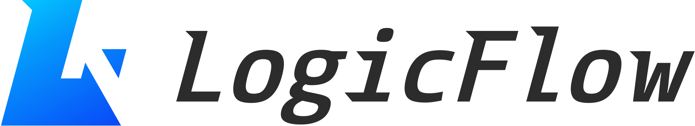

[](/docs/images/horizontal-logo.png)

## 安装方式

```shell
# npm
$ npm install @logicflow/core --save

# yarn
$ yarn add @logicflow/core
```

## 渲染组件

```vue
<template>
    <div ref="canvas" style="width: 100%; height: 100%"</div>
</template>
<script lang="ts" setup>
let lf = reactive();
const canvas = ref<HTMLElement | null>(null);
nextTick(() => {
  initRender();
});
const data = reactive({
  nodes: [
    {
      id: "0",
      type: "head",
      x: 600,
      y: 50,
      properties: {
        strHtml: "舆情处置机构",
      },
    },
    {
      id: "2-1",
      type: "vue-html",
      x: 600,
      y: 50,
      properties: {
        width: 100,
        height: 100,
        strHtml: "舆情处置机构",
      },
    },
  ],
});
function initRender() {
  if (!canvas.value) return;
  console.log(canvas.value);
  lf = new loginFlow_draw(canvas.value);
  lf.render(data);
  lf.register_click_event(enum_type_canvas.roles, (event) => {
    // console.log(event, "事件点击角色");
  });
  lf.register_change_event((event) => {
    // console.log(event, "数据改变");
  });
  lf.is_allowed_onnection(({ event, msg }) => {
    ElMessage.warning(msg);
  });
}
</script>
```


## 初始化节点

```typescript
/**
 * 引入logicFlow相关资源
 */
import "@logicflow/extension/lib/style/index.css";
import "@logicflow/core/dist/style/index.css";
import LogicFlow from "@logicflow/core";
import loginFlow_draw from "@/views/publicOpinionTraining/utils/config-loginFlow";
import { Menu } from "@logicflow/extension";


LogicFlow.use(Menu); // 右键菜单

```

## 封装LogicFlow注册逻辑

```typescript
const config_loginFlow = {
  grid: {
    size: 20,
    visible: true,
    type: "dot",
    config: {
      color: "#ababab",
      thickness: 1,
    },
  },
  textEdit: false,
  isSilentMode: false,
  edgeType: "polyline",
  snapline: true,
  nodeTextEdit: false,
  edgeTextEdit: false,
  edgeTextDraggable: false,
  nodeTextDraggable: false,
  style: {
    // 设置默认主题样式
    rect: {
      // 矩形样式
      width: 100,
      height: 50,
      radius: 6,
      fill: "#34415b",
    },
    circle: {
      // 圆形样式
      r: 40,
      fill: "#34415b",
    },
    nodeText: {
      // 节点文本样式
      fontSize: 16,
      color: "#ffffff",
    },
    edgeText: {
      // 边文本样式
      fontSize: 16,
      color: "#ffffff",
    },
    anchor: {
      // 锚点样式
      fill: "#6edd97",
    },
    polyline: {
      stroke: '#DFE6EC',
      strokeWidth: 2,
      strokeDashArray: '1,0',
      hoverStroke: '#000000',
      selectedStroke: '#000000',
      selectedShadow: true,
      offset: 30,
      outlineColor: '#000000',
      outlineStrokeDashArray: '3,3',
    },
    arrow: {
      offset: 0, // 箭头长度
      verticalLength: 0, // 箭头垂直于连线的距离
    },
  },
};

class loginFlow_draw {
  lf: LogicFlow;
  transformX: number = 0;
  transformY: number = 0;
  transformScale: number = 1;

  constructor(canvas: HTMLElement, options?: any) {
    this.lf = new LogicFlow({
      container: canvas,
      stopScrollGraph: true,
      stopZoomGraph: true,
      width: canvas?.clientWidth,
      height: canvas?.offsetHeight,
      ...config_loginFlow,
      ...options,
    });
    this.register_loginFlow_node();
  }

  /**
   * 获取画布数据
   */
  get_loginFlow_drawData() {
    return this.lf.getGraphData();
  }

  /**
   * 注册节点
   * @memberof loginFlow_draw
   */
  register_loginFlow_node() {
    this.lf.batchRegister([qrCode, head, roles, person, department]);
    this.lf.setMenuByType({
      type: enum_type_canvas.head,
      menu: [],
    });
    this.lf.setMenuByType({
      type: enum_type_canvas.department,
      menu: [
        {
          text: "删除",
          callback: (e: NodeConfig) => {
            ElMessageBox.confirm("是否删除该节点及周边连线?‘", "提示")
              .then(() => {
                if (e.id != null) {
                  this.lf.deleteNode(e.id);
                }
              })
              .catch(() => {
                // catch error
              });
          },
        },
      ],
    });
    this.lf.setMenuByType({
      type: enum_type_canvas.roles,
      menu: [
        {
          text: "删除",
          callback: (e: NodeConfig) => {
            ElMessageBox.confirm("是否删除该节点及周边连线?", "提示")
              .then(() => {
                if (e.id != null) {
                  this.lf.deleteNode(e.id);
                }
              })
              .catch(() => {
                // catch error
              });
          },
        },
      ],
    });
    this.lf.setMenuByType({
      type: "polyline",
      menu: [
        {
          text: "删除",
          callback: (e: NodeConfig) => {
            ElMessageBox.confirm("是否删除该条连接线?", "提示")
              .then(() => {
                if (e.id != null) {
                  this.lf.deleteEdge(e.id);
                }
              })
              .catch(() => {
                // catch error
              });
          },
        },
      ],
    });
    // 节点缩放后更新文案位置
    this.lf.on("graph:transform", (data) => {
      this.transformX = data.transform.TRANSLATE_X;
      this.transformY = data.transform.TRANSLATE_Y;
      this.transformScale = data.transform.SCALE_X;
    });
    // this.lf.extension.selectionSelect.openSelectionSelect(); //开启框选
  }

  /**
   * 重绘
   * @memberof loginFlow_draw
   * @param data
   */
  render(data: any) {
    this.lf.render(data);
  }

  /**
   * 添加节点
   * @param node
   */
  add_loginFlow_node(node: NodeConfig) {
    this.lf.addNode(node);
  }

  /**
   * 添加边
   * @param edge
   */
  addEdge_loginFlow_node(edge: EdgeConfig) {
    this.lf.addEdge(edge);
  }

  /**
   *点击事件注册
   * @param type
   * @param callback
   */
  register_click_event(type: enum_type_canvas, callback: Function) {
    this.lf.on("element:click", (eventObject) => {
      if (type === eventObject.data.type) {
        callback(eventObject);
      }
    });
  }

  /**
   *改变事件注册
   * @param type
   * @param callback
   */
  register_change_event(callback: Function) {
    this.lf.on("history:change", (eventObject) => {
      callback(eventObject);
    });
  }

  /**
   * 不允许建立连接
   * @param type
   * @param callback
   */
  is_allowed_onnection(callback: Function) {
    this.lf.on("connection:not-allowed", (eventObject) => {
      callback(eventObject);
    });
  }
  clear_canvas() {
    this.lf.clearData();
  }
  custom_loginFlow() {
    const v = this.lf.getGraphData();
  }
}

export default loginFlow_draw;

```


## 自定义节点的创造（vue3 || html）

- html节点（核心是mvvm,htmlnode 节点使用 innerHtml）

```typescript
import LogicFlow, { HtmlNode, HtmlNodeModel } from "@logicflow/core";
import {enum_type_canvas} from "@/views/publicOpinionTraining/utils/enum";

/**
 *     {
 *       id: "node_8",
 *       type: "head",
 *       x: 400,
 *       y: 100,
 *       properties: {
 *         strHtml: `<span class="head_content"><div class="head_fz">舆情处置机构</div> </span>`,
 *       },
 *     },
 */
class UmlModel extends HtmlNodeModel {
  setAttributes() {
    const width = 100;
    const height = 40;
    this.width = width;
    this.height = height;
    /**
     * 描点的位置
     * @type {[number, number][]}
     */
    this.anchorsOffset = [
      [0, height / 2],
      [0, -height / 2],
    ];
    const OnlyAsTarget = {
      message: "部门节点上一个节点只能是处置机构",
      validate: (source: any, target: any) => {
        return source.type === enum_type_canvas.head;
      },
    };

    const OnlyAsSource = {
      message: "部门节点下一个节点只能是人员角色",
      validate: (source: any, target: any) => {
        console.log(source.type, target.type, "指向 其他角色");
        return target.type === enum_type_canvas.roles;
      },
    };
    const edgeRuleAsSource = {
      message: "节点上只能一个边",
      validate: (sourceNode: any, targetNode: any) => {
        const { graphModel } = sourceNode;
        const edges = graphModel.getNodeEdges(sourceNode.id);
        return edges.length < 1;
      },
    };
    /**
     * 校验连线规则
     */
    this.sourceRules.push(OnlyAsSource, edgeRuleAsSource);
    this.targetRules.push(OnlyAsTarget);
  }
}

class UmlNode extends HtmlNode {
  setHtml(rootEl: HTMLElement) {
    this.ref.setAttribute("stroke", "");
    const { properties } = this.props.model;
    const el = document.createElement("div");
     /**
     * 引入自定义数据
     */
    el.className = "depart-wrapper";
    el.innerHTML = `${properties.strHtml}`;
    // 需要先把之前渲染的子节点清除掉。
    rootEl.innerHTML = "";
    rootEl.appendChild(el);
  }
}

const department = {
  type: enum_type_canvas.deartment,
  view: UmlNode,
  model: UmlModel,
};
export default department;
```

## vue3

```typescript
import { HtmlNode, HtmlNodeModel } from "@logicflow/core";
import { App, createApp } from "vue";
import VueNode from './VueNode.vue';

class VueHtmlNode extends HtmlNode {
  app: App<Element>;

  constructor(props: any) {
    super(props);
    const appRef = ref<null | { test: Function; setVal: Function }>(null);
    this.app = createApp({
      render: () =>
        h(VueNode, {
          ref: appRef,
        }),
      mounted: () => {
        if (!appRef.value) return;
        /**
         * 这里可以调用Vue组件的方法
         * appRef.value.test()
         * appRef.value.setVal()
         * props.model.getProperties()获取节点properties的数据
         * 可以使用vue-node:click lf.on('vue-node:click',()=>{}) 监听节点点击事件
         */
        appRef.value.test(props.model.getProperties());
        appRef.value.setVal((val: any) => {
          this.props.graphModel.eventCenter.emit("vue-node:click", {
            id: this.props.model.id,
            val,
          });
        });
      },
    });
  }

  setHtml(rootEl: HTMLElement) {
    const node = document.createElement("div");
    rootEl.appendChild(node);
    this.app.mount(node);
  }
}

class VueHtmlNodeModel extends HtmlNodeModel {
  setAttributes() {
    this.width = 100;
    this.height = 100;
    this.text.editable = false;
  }

  getOutlineStyle() {
    const style = super.getOutlineStyle();
    style.stroke = "none";
    return style;
  }
}

export default {
  type: "vue-html",
  model: VueHtmlNodeModel,
  view: VueHtmlNode,
};

```

```vue
<template>
  <div
    :style="{
      width: properties?.width + 'px',
      height: properties?.height + 'px',
    }"
    class="demo-collapse"
  >
    <button @click="clickFun">
      {{ properties?.strHtml }}
    </button>
  </div>
</template>
<script lang="ts" setup>
// 声明该模板节点需要接收的数据类型
type TFlowProps = {
  strHtml: string;
  height: number;
  width: number;
};
const emit = defineEmits(["btn:click"]);

const properties = ref<TFlowProps>({
  strHtml: "",
  height: 0,
  width: 0,
});

const test = (props: TFlowProps) => {
  properties.value = props;
};
let btn: any = null;

function clickFun() {
  btn(properties.value);
}

const setVal = (callback: Function) => {
  btn = callback;
};
/**
 * 必须暴露出去，要不没法接受
 */
defineExpose({
  test,
  setVal,
});
</script>
<style lang="scss">
.demo-collapse {
  color: #1ab394;
  background-color: #2a7bee;
  display: flex;
  align-items: center;
  border-radius: 10px;
}
</style>
```

### 方法汇集

```typescript
 // 画点
  lf.add_loginFlow_node({
    id: uuid,
    type: currentData.type,
    x,
    y,
    properties: {
      strHtml: `<span class="head_content">${currentData.btnData.dictValue}</div> </span>`,
    },
  });
  //画线
  lf.addEdge_loginFlow_node({
    type: "polyline",
    sourceNodeId: point,
    targetNodeId: uuid,
  });


/**
 * 此方法使用广度优先搜索（BFS）从 head 节点开始遍历所有连通的节点，并将它们添加到一个集合中。然后，根据这个集合过滤出连接到 head 节点的节点和边，删除那些不连通的节点。
 * @param data
 */
/**
 * 过滤并返回只包含连接组件的节点和边的数据。
 * @param data 包含节点和边的数据对象。
 * - data.nodes 是一个节点数组，每个节点包含一个类型和一个id。
 * - data.edges 是一个边数组，每个边包含源节点id和目标节点id。
 * @param nodeType
 * @param id
 * @returns 返回一个对象，包含过滤后的节点和边数组。如果不存在头节点（type为'head'的节点），则返回undefined。
 */
export function filterIsConnectedContNodes<T, enum_type_canvas>(
  data,
  nodeType = enum_type_canvas.head,
  id?: string,
): T {
  const { nodes, edges } = data;
  // 查找数据中的头节点
  const headNode = nodes.find((node) =>
    id ? node.id === id : node.type === nodeType,
  );
  if (!headNode) return;

  // 使用Set来存储已连接的节点id
  const connectedNodes = new Set();
  connectedNodes.add(headNode.id);
  // 使用队列来进行广度优先搜索
  const queue = [headNode.id];
  while (queue.length > 0) {
    const currentNodeId = queue.shift();
    // 遍历所有边，将与当前节点连接且未被访问过的节点加入队列和已连接节点集合
    edges.forEach((edge) => {
      if (
        edge.sourceNodeId === currentNodeId &&
        !connectedNodes.has(edge.targetNodeId)
      ) {
        connectedNodes.add(edge.targetNodeId);
        queue.push(edge.targetNodeId);
      }
    });
  }
  // 返回过滤后的节点和边，只包含在已连接节点集合中的那些
  return {
    nodes: nodes.filter((node) => connectedNodes.has(node.id)),
    edges: edges.filter(
      (edge) =>
        connectedNodes.has(edge.sourceNodeId) &&
        connectedNodes.has(edge.targetNodeId),
    ),
  };
}

/**
 * 根据方向获取矩形对应位置的值
 * @param position
 * @param direction
 * @param rect
 */
enum direction_Point {
  top = 0,
  right = 1,
  bottom = 2,
  left = 3,
}
export function getRectPointValue(
  position: number[],
  direction: direction_Point,
  rect: number[] = [100, 80],
) {
  const [x, y] = position;
  const [width, height] = rect;
  switch (direction) {
    case direction_Point.top:
      return [x, y - height / 2];
    case direction_Point.right:
      return [x + width / 2, y];
    case direction_Point.bottom:
      return [x, y + height / 2];
    case direction_Point.left:
      return [x - width / 2, y];
    default:
      throw new Error("Invalid direction");
  }
}

/**
 * 根据最近的点的数据
 * @param position
 * @param startPoin
 */
export function getNearestPoint(position: number[][], startPoin: number[]) {
  if (position.length === 0) return null;

  let nearestPoint = position[0];
  let minDistance = Math.abs(nearestPoint[0] - startPoin[0]) + Math.abs(nearestPoint[1] - startPoin[1]);

  position.forEach(endPoint => {
    const distance = Math.abs(endPoint[0] - startPoin[0]) + Math.abs(endPoint[1] - startPoin[1]);
    if (distance < minDistance) {
      minDistance = distance;
      nearestPoint = endPoint;
    }
  });

  return nearestPoint;
}
```

